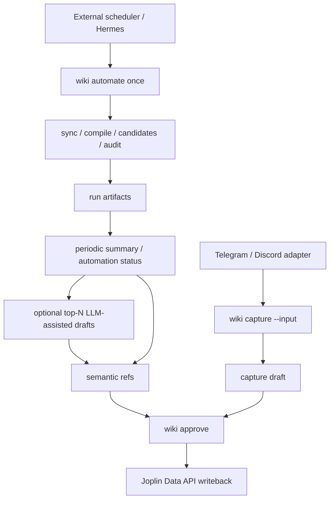

## Context

目前 Hermes Wiki Engine 的核心已經是 review-gated wiki substrate：`wiki sync` 從 Joplin Data API 讀取 source snapshot，`wiki compile` 產生 source-backed page，`wiki draft candidates` 與 consolidation draft 產生待審草稿，`wiki audit` 檢查結構與來源，`wiki approve` 是唯一能正式寫回 Joplin 的 gate。

完整自動沉澱還缺四個成熟工程領域的能力：

- local job scheduling：把 sync／compile／candidate／audit 串成可由 launchd、cron 或 Hermes 外部 runner 呼叫的一次性 pipeline。
- LLM-assisted knowledge management：用 LLM 協助摘要、去重、主題頁整理，但產物必須是可 review 的 draft，不是直接事實來源。
- semantic search／retrieval：用 embedding 或語意索引改善大型筆記庫的候選發現與查詢召回，但回答仍回到 source refs。
- capture ingestion pipeline：把 Telegram／Discord 等外部訊息轉成待審 capture draft，並處理 allowlist、rate limit、redaction 與 failure evidence。

這些領域都有成熟模式，主流做法通常會引入 daemon、queue、worker、vector DB、bot framework、observability stack。此 repo 現階段不採完整平台化，因為 Hermes Wiki Engine 的價值邊界是 local-first、Joplin SSOT、可審核寫回。最小可維護設計是：新增可組合 CLI 與 artifacts，讓外部排程器或 Hermes 呼叫，避免把 repo 變成長駐多租戶 agent 平台。

## Goals

- 以分期方式建立自動沉澱能力，每一期都能獨立驗證且不破壞既有 CLI。
- 保留 `wiki approve` 作為唯一正式 Joplin writeback gate。
- 讓自動化流程只產生 run artifact、candidate、recommendation、semantic index 或 reviewable draft。
- 讓 foreground query/read 仍以 compiled page 與 source refs 為事實來源，不隱性觸發背景工作。
- 優先使用 Node stdlib、本機 artifacts、Joplin Data API 與 local `ollama call`，避免第一輪引入 queue service、database server、vector DB 或 cloud LLM requirement。

## Non-Goals

- 不建立永遠常駐的內建 daemon process；第一期提供可由 launchd／cron／Hermes 呼叫的一次性 runner。
- 不自動 approve、merge 或寫回 Joplin。
- 不直接讀寫 Joplin SQLite、profile 或 filesystem internals。
- 不把 pending draft、LLM output 或 semantic score 當成正式 answer source。
- 不在第一輪支援 attachment OCR、binary indexing、多使用者 bot、web dashboard 或跨裝置同步。
- 不要求使用者提供 cloud LLM API key 才能使用基本 wiki 功能。

## Phased Design

### Phase 1：Background Pipeline Runner

新增 `wiki automate once` 與 `wiki automate status`。

`wiki automate once` 串起既有維護步驟：sync、compile、draft candidate discovery、audit。它只產生 artifacts：

- `automation/runs/<run-id>.json`：記錄 started_at、finished_at、steps、exit_code、warnings、artifact refs。
- `automation/latest.json`：指向最後一次 run，讓 Hermes skill 或 operator 快速讀取狀態。
- optional summary output：CLI stdout 的短摘要，方便 launchd／cron log 保存。

runner 失敗時要停在 failure step，留下 step evidence，不吞掉錯誤。若 workspace lock 已被其他 wiki 命令持有，回傳 busy 狀態，不重入執行。runner 不呼叫 `wiki approve`，也不寫回 Joplin。

### Phase 2：LLM-Assisted Consolidation

新增 LLM draft producer，目標是補強目前 page compilation 很薄與 candidate discovery 太粗的缺口。

設計重點：

- input 必須是 compiled source refs、candidate refs 或明確 note refs。
- output 是 reviewable consolidation draft，不是正式 compiled page。
- draft 必須記錄 `provenance.llm`：provider、model、prompt_version、source_refs、created_at、evidence_status。
- 預設 provider 是 local `ollama call`；沒有 provider 時 fail closed，回報可操作錯誤，不產生半成品 draft。
- prompt 要要求 source-backed summary、duplicate／related-note recommendation、open questions；沒有 evidence 的內容標成 unknown 或 omission，不允許假裝已知。

### Phase 3：Semantic Retrieval Layer

新增可重建 semantic index，用來改善大型 Joplin library 的候選發現與查詢召回。

設計重點：

- index source 只來自 compiled artifacts，不直接掃 Joplin SQLite。
- index artifact 包含 chunk id、page id、source refs、content hash、embedding model、vector metadata、generated_at。
- `wiki semantic build` 建立或重建 index。
- `wiki semantic query` 回傳 scored refs 與 snippets，不直接產生最終 answer。
- foreground `wiki query` 可以選擇讀 semantic refs，但最終回答仍必須回到 `wiki read`／compiled source refs。
- index stale、missing 或 provider missing 時回傳明確狀態，不阻塞既有 keyword/read flow。

### Phase 4：Capture Bot／Ingestion

新增 Telegram／Discord capture ingestion 的最小安全邊界。第一輪優先支援 normalized event batch input，讓實際 bot adapter 可以在 Hermes 或外部 process 執行；repo 內負責驗證、redaction、dedupe key 與 filesystem draft 產生。

設計重點：

- `wiki capture telegram --input <path>` 與 `wiki capture discord --input <path>` 接收 normalized JSON events。
- 每筆 event 必須通過 source allowlist、workspace allowlist 或 chat/channel allowlist。
- ingestion 產物是 filesystem capture draft，包含 source、message id、author handle hash、timestamp、redaction warnings、dedupe key。
- secret、token、email、phone 等敏感片段先 redaction，再進 draft body。
- rate limit 與 duplicate event 不產生重複 draft，並寫入 capture run evidence。
- 不直接建立 Joplin note；正式沉澱仍由 consolidation／approve 流程處理。

### Phase 5：Periodic Whole-Library Consolidation

新增定期全庫整理 handoff，但不把 repo 變成常駐 scheduler。成熟領域上，這屬於 local job scheduling 與 operator review workflow；主流會用 daemon、queue、dashboard 與 worker pool。此 repo 採更小設計：提供可被 Hermes、launchd 或 cron 呼叫的一次性 CLI 與 artifacts，讓外部排程器負責時間，wiki-engine 負責可重建 evidence。

設計重點：

- `wiki automate status` 讀取 `automation/latest.json` 與對應 run artifact，回傳 machine-readable status；missing latest 時回 `AUTOMATION_STATUS_MISSING`。
- `wiki automate once --draft-top N` 在既有 sync／compile／candidate／audit 後，從 bounded candidate list 取前 N 個 still-pending candidates，呼叫 LLM-assisted consolidation producer 產生 reviewable drafts。
- `--draft-top` 預設是 0；沒有明確指定時，automation 仍只產生 candidates 與 audit，不自動產 LLM draft。
- 每次 periodic run 寫入 summary artifact，例如 `automation/summaries/<run-id>.json`，包含 run id、candidate count、draft count、audit error count、notification result、next action。
- 若 LLM provider missing，periodic run 不應失敗整體 maintenance pipeline；summary 要記錄 `LLM_PROVIDER_MISSING`，draft count 為 0，next action 指向 provider setup 或 manual candidate review。
- 若 top-N candidates 沒有 target notebook，draft 仍可存在，但 summary 必須標記 `target_required`，讓 operator approve 前補 target。
- 通知走既有 `wiki notify discord` / `--notify` 類型的安全輸出；通知內容不得包含 token、raw prompt、raw note body 或 Joplin token。
- 正式寫回仍只由 `wiki approve <draft-id>` 執行；periodic run 不得呼叫 approve。

## Operator Flow

## Safety Invariants

- 只有 `wiki approve` 能呼叫 Joplin writeback path。
- automation、LLM、semantic、capture 命令都不能直接建立、更新或刪除 Joplin note。
- 所有 LLM／semantic／capture 產物都要帶 source refs 或 provenance。
- foreground read/query 不隱性啟動 sync、compile、LLM、embedding 或 capture jobs。
- capture ingestion 對 allowlist、redaction、duplicate、rate limit 的拒絕結果要可稽核。
- periodic whole-library consolidation 可以自動產生 reviewable drafts 與通知摘要，但不得自動 approve。

## Implementation Contract

### Phase 5：Periodic Whole-Library Consolidation

**Behavior:** `wiki automate status` SHALL return the latest automation state without starting sync, compile, LLM, semantic build, capture, or approve. `wiki automate once --draft-top N` SHALL run the maintenance pipeline, then create at most N LLM-assisted consolidation drafts from the current candidate artifact and write a periodic summary artifact. `--draft-top 0` and omitted `--draft-top` SHALL create no LLM drafts.

**Interface / data shape:**

- `wiki automate status` returns JSON with `ok`, `state`, `latest_run_id`, `latest_run_path`, `latest_run`, and `summary` when artifacts exist.
- Missing latest automation state returns `{ ok: false, code: "AUTOMATION_STATUS_MISSING" }`.
- `wiki automate once --draft-top N` accepts non-negative integer N. Invalid, negative, or non-integer values return `{ ok: false, code: "AUTOMATION_DRAFT_TOP_INVALID" }` before running maintenance.
- `automation/summaries/<run-id>.json` contains `run_id`, `created_at`, `candidates_seen`, `drafts_created`, `draft_ids`, `audit_total_errors`, `notification`, `warnings`, and `next_actions`.
- Drafts created by periodic consolidation MUST use the same reviewable consolidation draft shape as `wiki draft llm-consolidate` and MUST include source refs and `provenance.llm`.

**Failure modes:**

- Existing lock returns `WIKI_BUSY` and does not start maintenance or create a summary.
- Pipeline failure before candidate discovery records the failed run artifact and does not attempt LLM draft creation.
- LLM provider missing records a summary warning `LLM_PROVIDER_MISSING`, creates zero LLM drafts, and keeps the run available for manual candidate review.
- Notification failure is recorded under `notification` and does not mark the maintenance run failed.

**Acceptance criteria:**

- `node --test test/wiki.test.js --test-name-pattern "periodic"` covers status missing, status readback, omitted `--draft-top`, invalid `--draft-top`, top-N draft creation, provider missing warning, and no approve/writeback.
- A CLI fixture verifies `wiki automate status` returns the latest completed run after `wiki automate once`.
- `spectra analyze phase-automated-knowledge-sedimentation` and `spectra validate phase-automated-knowledge-sedimentation --strict` pass after artifact updates.

**Scope boundaries:**

- In scope: CLI options, local JSON artifacts, Hermes skill documentation, tests, and existing Discord notification integration.
- Out of scope: installing launchd plist, implementing a daemon, adding a queue service, adding a web dashboard, automatically choosing permanent Joplin target notebooks, automatically approving drafts, deleting or rewriting existing Joplin notes, and introducing new runtime dependencies.

## Verification Strategy

- 每一期先以 `node --test` 補對應 CLI／artifact 測試，再實作。
- 以 fixtures 測試 provider missing、busy lock、partial failure、stale index、capture duplicate、capture secret redaction。
- 更新 `docs/design.md` 與 Hermes wiki skill，讓 operator 明確知道哪些命令可自動跑、哪些流程必須停在 review gate。
- 針對定期全庫整理，以 `periodic` 測試覆蓋 `wiki automate status`、`--draft-top N`、summary artifact、provider missing warning、notification failure 與 approve-only writeback。
- 完成 change 前執行 repo 最小測試、`spectra analyze` 與 `spectra validate`。
